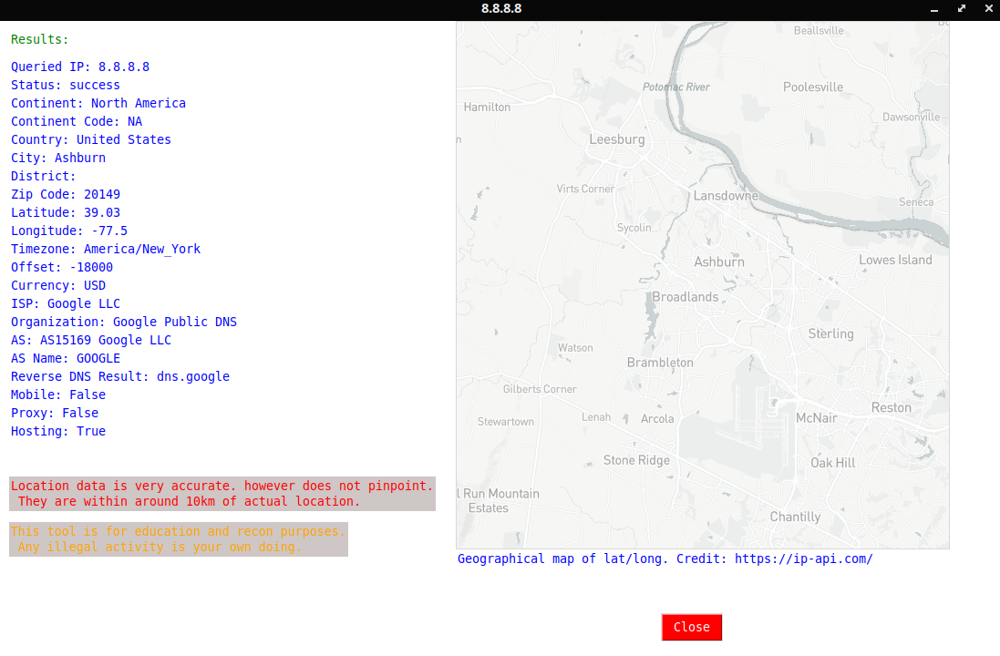

# GeoTracer
IP Lookup, with more detail than you think.

GeoTracer is a handwritten Python program built to query IP addresses to get *a lot of information*. Currently the location data is accurate up to around 10km loci. This tool was built for educational and reconaissance purposes, and should NOT be used illegally. Whether you do or not, that is up to you, but I do not assume any responsibility.

This tool works with both IPv4 and IPv6 addresses and is based off of the https://ip-api.com/ API and locators, meaning you do only have the 40 requests per unit time that they specify. You might get away with using a VPN, or you can purchase a license and edit the source code to use your license key for infinite requests (and more data if you really want to).

Dependencies:

-Tkinter 
-requests 
-Pillow/PIL 
-urllib (if you somehow do not have it). 

This project is open source, and as such you can use this comercially and change it how you like. Please do leave the credits, I work hard to make these tools and it is a load of fun! You should see two files: geotracer and geotracer.py.

geotracer.py can be run via the shell (please do), and geotracer is the standalone executable if you wish to just run it with no faffing around. On Ubuntu 20.10 (what this was developed on), the executable will not run by itself and needs to be initiated via a shell or terminal, though your mileage may vary. The executable has Python built in, hence why it is *gigantic* (apologies). 

Any issues, please start an issue on this repository and I will get to you as soon as I can.

Any suggestions, email me: theenigmaproject@cyberservices.com

And as always, stay safe guardian.
